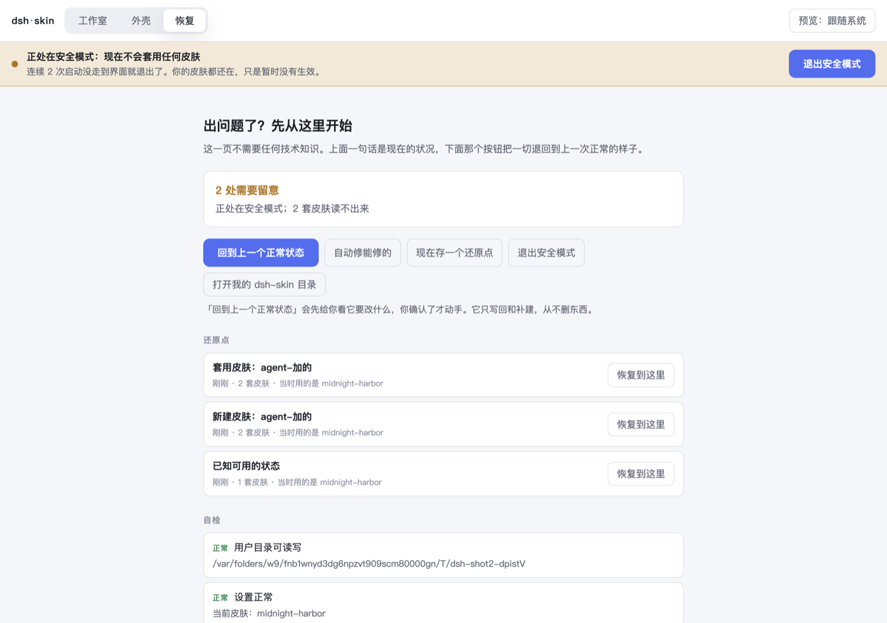

# Recovery, and how an agent should drive it
# 出事之后 —— 给用户，也给 agent

This page exists because of a specific, ordinary failure: someone who does not write code depends on
an AI agent to run this software, the agent does something wrong, and then the agent's session ends.
No terminal knowledge, no colleague to ask, and the thing that used to answer questions is gone.

这一页是为一个很普通的失败场景写的：一个不写代码的人靠 AI agent 操作这个软件，agent 做错了一件事，
然后那个会话结束了。他没有终端知识，没有人可问，而那个一直替他回答问题的东西已经不在了。

---

## Part 1 · 给用户：不需要懂技术

### 程序还打得开

点顶部的 **恢复** 页签。第一行会用一句话告诉你现在什么状况，下面第一个按钮是
**「回到上一个正常状态」**。

它会先把「要改什么」列给你看，你点确认才动手。**它只写回和补建，从不删任何东西** ——
所以点它不会让事情更糟，最坏的情况是没变化。



### 程序打不开了

**先多双击两次。** 程序连续两次没能启动到界面，就会**自动**进入安全模式：
下一次启动不套任何皮肤、不轮播。你的皮肤一套都没丢，只是暂时没生效。

还是不行的话，打开这个文件夹 —— 里面的文件**双击就行，不需要输入任何东西**：

- **Mac**：访达 → 菜单栏「前往」→「前往文件夹」→ 粘贴 `~/.dsh-skin/急救`
- **Windows**：文件资源管理器地址栏粘贴 `%USERPROFILE%\.dsh-skin\急救`

```
1 看看出了什么问题      先点这个。只看，不改。
2 回到上一个正常状态    给你看它打算改什么（还没真的改）
3 确认回退              看过第 2 步没问题，再点这个
4 下次启动不套皮肤      程序打不开时先点它，再去打开程序
5 恢复正常启动          问题解决后点它
```

这些文件调用的是**程序自己**，所以你电脑上没装 Node、没装任何开发工具也能用。
它们每次程序启动时自动更新，删了也没关系。

<details>
<summary>会用终端的话（可选，效果一样）</summary>

```bash
npx @dsh-skin/cli doctor
```

它会列出现在什么状况，每一条后面跟着该跑哪条命令。三条最常用的：

```bash
npx @dsh-skin/cli undo             # 看一眼「退回上一个还原点」会改什么（只是预演，不动手）
npx @dsh-skin/cli undo --yes       # 真的退回去
npx @dsh-skin/cli safe-mode on     # 下次启动不套任何皮肤
```

</details>

### 手上有 AI 助手但它不懂这个软件

把下面这段整个复制给它 —— 任何一个能跑命令的 AI 助手都能照着做：

> 我在用一个叫 dsh-skin 的皮肤软件，出问题了。请你：
> 1. 跑 `npx @dsh-skin/cli doctor --json`，读它的输出。
> 2. 每一条 `level` 不是 `ok` 的结论里都带着 `fix.command`，告诉我它们分别是什么意思。
> 3. 如果需要回退，先跑 `npx @dsh-skin/cli undo`（这只是预演），把它要改什么念给我听，
>    我同意之后你再加 `--yes` 执行。
> 4. 不要删除 `~/.dsh-skin` 下的任何文件，也不要删任何皮肤目录。恢复不需要删东西。

---

## Part 2 · 给 agent：操作契约

### 现场都在这一个目录里

```
~/.dsh-skin/
├── skins/          用户自己的皮肤（内置皮肤在程序包里，不在这）
├── state.json      设置。字段有取值范围，越界会被自动收拢
├── history/        还原点，每次改动前自动存，最多 30 个
├── quarantine/     坏掉的 state.json 会被挪到这里，不会被静默覆盖
├── install.json    程序启动时写的：它装在哪、内置皮肤在哪、什么版本
├── 急救/           双击就能跑的急救脚本，程序每次启动时重写
├── SAFE_MODE       这个文件存在 = 安全模式开着
└── boot.lock       启动断路器的标记；界面出来就删掉
```

`DSH_SKIN_HOME` 可以改这个位置（测试时务必用它，别动用户真实的目录）。

### 四条硬规矩

**1 · 动手之前先 `doctor --json`。** 不要凭症状猜。`level` 是 `ok` / `warn` / `error`；
`checks[].fix.command` 是可以直接执行的命令。只有 `error` 会让退出码非零 ——
`warn` 是「留意」，不是失败。

**2 · 回退默认是预演。** `undo` 不加 `--yes` 只报告不动手。**永远先把预演结果念给用户听，
得到同意再执行。** 一个非技术用户无法判断「恢复」会不会让情况更糟，你有义务先告诉他。

**3 · 永远不要删。** 恢复机制本身从不删文件；你也别删。快照只存文本（`skin.json`、
`skin.css`、`palette.json`），**素材图删了就找不回来了**。用户目录里的东西是他的，
不是你的工作区。

**4 · 你自己也会崩。** 所以在做任何有风险的事之前，显式存一个带说明的还原点：

```bash
npx @dsh-skin/cli snapshot -m "改配色之前"
```

程序自己在套用皮肤、新建、导入、删除之前会自动存；但你在**命令行里**直接改文件时不会 ——
那时候存还原点是你的责任。

### 命令

所有命令都支持 `--json`，输出机器可读的结构。

| 命令 | 做什么 | 会改东西吗 |
|---|---|---|
| `doctor` | 体检，每条结论带 `fix` | 否 |
| `doctor --fix` | 只做安全的自动修复（切走用不了的皮肤、收拢越界设置） | 是，但不删 |
| `history` | 列出还原点 | 否 |
| `undo [id]` | 预演回退 | 否 |
| `undo [id] --yes` | 真的回退（并先给现状也存一个还原点） | 是，只写回和补建 |
| `snapshot -m "说明"` | 现在存一个还原点 | 是（只新增） |
| `safe-mode on\|off\|status` | 安全模式 | 是（一个标记文件） |
| `validate <路径>` | 检查皮肤，有 error 退出码 1 | 否 |

### `doctor --json` 的形状

```json
{
  "ok": false,
  "level": "error",
  "checks": [
    { "id": "current-skin", "level": "error",
      "title": "选中的皮肤 xxx 不存在",
      "detail": "程序会显示成没有皮肤。…",
      "fix": { "command": "dsh-skin undo", "description": "回到删掉它之前的那个还原点。" } }
  ],
  "summary": { "root": "…", "safeMode": false, "skins": 7, "brokenSkins": 0,
               "blockedSkins": 1, "currentSkin": "xxx", "restorePoints": 12 }
}
```

`checks[].id` 是稳定的，可以拿来分支：`home` `state` `safe-mode` `boot` `install`
`skins-broken` `skins-blocked` `current-skin` `history`。

### 常见症状 → 真因

| 用户说 | 先看 | 多半是 |
|---|---|---|
| 「换了皮肤但界面没变」 | `current-skin` | 那套皮肤被检查器拦着（多半引用了远程 URL），所以根本没被注入 |
| 「皮肤不见了」 | `current-skin` + `history` | 皮肤被删或改名；`undo` 能把文本补回来，素材图不行 |
| 「双击图标没反应」 | `boot` | 连续两次启动没走完；再开一次就会自动进安全模式 |
| 「设置全没了」 | `state` | `state.json` 坏了，原件在 `quarantine/`；`undo` 能拿回旧设置 |
| 「背景图不显示」 | `skins-blocked` | 素材路径不存在，或文件名里有 `#` 这类字符（新版已修） |
| 「点换下一张没反应」 | — | 旧版本的 bug（关闭轮播时游标没人读），升级即可 |

### 不要做的事

- **不要直接编辑 `state.json` 之后不跑校验。** 字段有取值范围；写一个 `rotateMinutes: 0`
  进去会让轮播每分钟触发一次。用 `doctor --fix` 或让程序自己写。
- **不要用「删掉重装」当修复手段。** 这个软件的用户数据就在 `~/.dsh-skin` 里，删掉等于
  把他自己做的皮肤一起删了，而那是还原点也救不回来的部分（素材图不进快照）。
- **不要在没有还原点的情况下开始改。** `doctor` 会告诉你有几个；一个都没有就先 `snapshot`。
- **不要替用户决定「要不要回退」。** 预演给他看，他说了算。
